<h1>Shoe Store</h1>

## 🌟 Tính Năng Nổi Bật

### 🛍️ Trải Nghiệm Người Dùng

| Tính Năng                     | Mô Tả                                                                     |
| ----------------------------- | ------------------------------------------------------------------------- |
| **🔍 Tìm Kiếm Thông Minh**    | Lọc sản phẩm theo thương hiệu, size, giá, và loại giày (TF/IC)            |
| **🎯 Khuyến Mãi Cá Nhân Hóa** | Hiển thị sản phẩm "Hot Sell" với mức giảm giá lên đến 100%                |
| **🛒 Giỏ Hàng Đa Năng**       | Thêm/Xóa sản phẩm, lưu vào danh sách yêu thích, thanh toán đa phương thức |
| **📊 Thống Kê Cá Nhân**       | Theo dõi lịch sử mua hàng và trạng thái đơn hàng trực quan                |

### 🛠️ Bảng Điều Khiển Quản Trị

<div style="display: flex; gap: 20px; margin-top: 15px;">
  <div>
    <h4>📈 Analytics Hub</h4>
    <ul>
      <li>Biểu đồ doanh thu theo tháng/năm</li>
      <li>Tỷ lệ sản phẩm bán chạy</li>
      <li>Xu hướng mua sắm theo khu vực</li>
    </ul>
  </div>
</div>

---

## 🖼️ Hình Ảnh Trực Quan

## 1. Giao diện của Admin

### Trang chủ quản lý thống kê chung

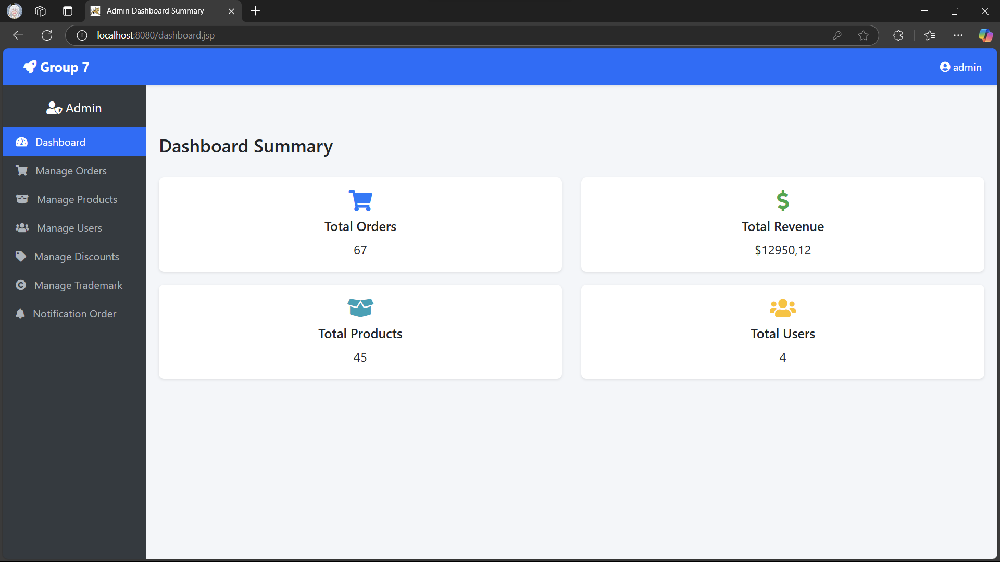
_trang thống kê các chỉ số chung như tổng doanh thu, số lượng sản phẩm, số lượng order_

### Trang quản lý order khách hàng

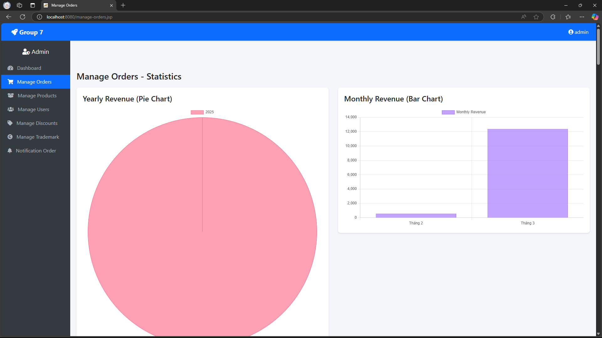
_thể hiện các chỉ số như doanh thu theo tuần, tháng, các sản phẩm bán chạy nhất,..._

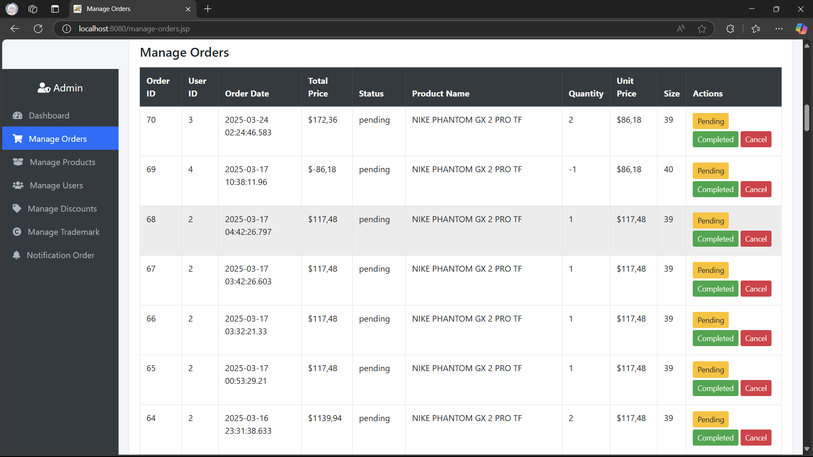
_thống kê lịch sử mua hàng_

### Trang quản lý sản phẩm

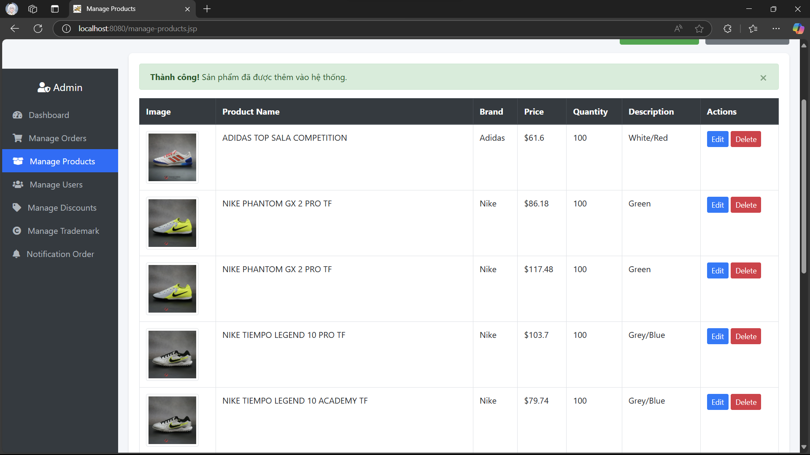
_quản lý các sản phẩm hiện có trong trang web_

### Trang quản lý các tài khoản của user

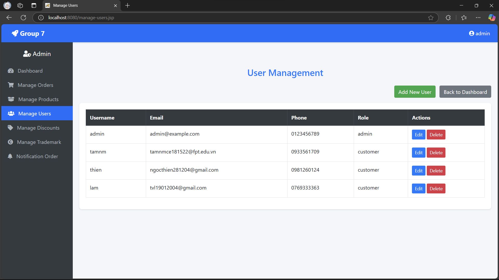
_thống kê, quản lý số người dùng trong trang web_

### Trang quản lý giảm giá

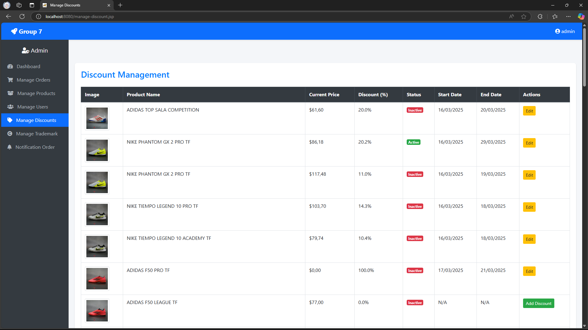
_quản lý khuyến mãi giảm giá theo % và thiết lập thời gian linh động_

### Trang quản lý các hãng giày

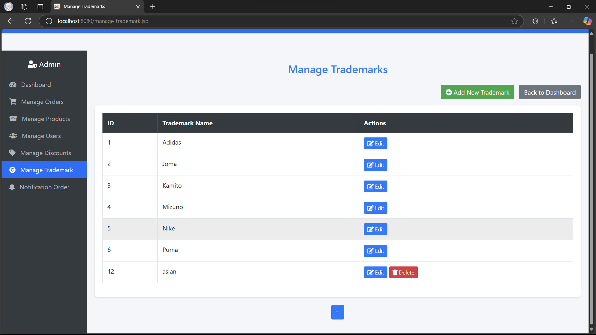
_quản lý các hãng giày đang có trong trang web_

### Trang quản lý trạng thái đơn hàng

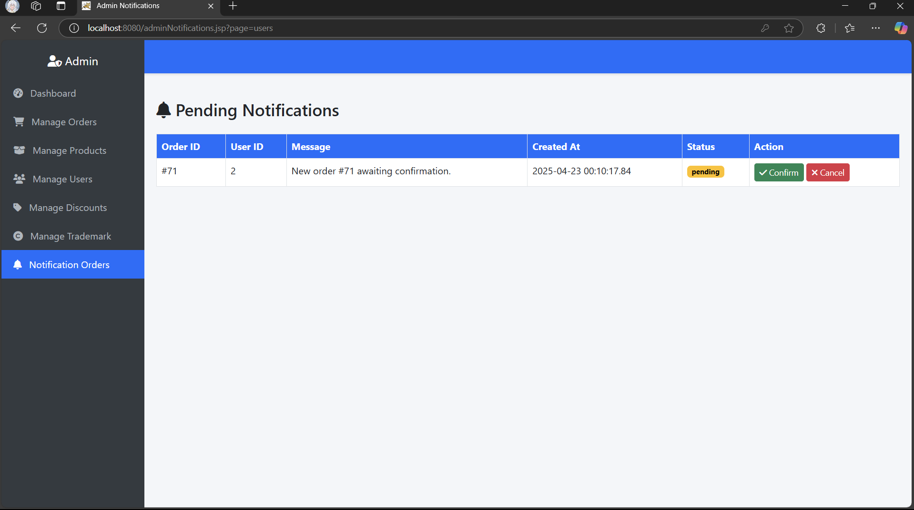
_cập nhật trang thái khi người dùng đặt hàng, chờ xác nhận, xác nhận thành công/hủy. trong lúc chờ xác nhận được người dùng có thể hủy hoặc sửa đơn hàng_

## 2. Giao diện của User

### Trang chủ

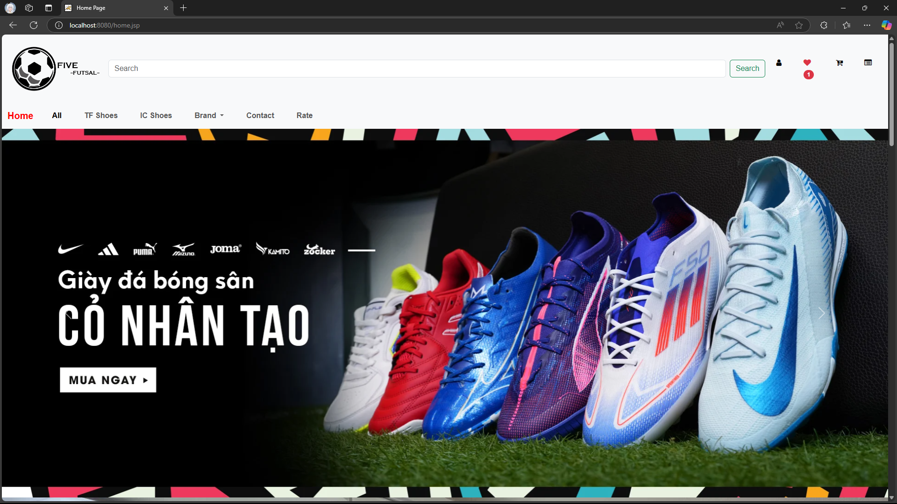
_trang chủ của website_

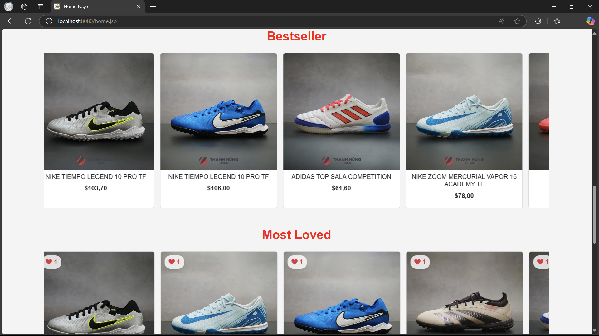
_hiển thị các sản phẩm được giảm giá tốt nhất, có lượt yêu thích cao nhất, có lượt bán nhiều nhất_

### Trang các hãng giày

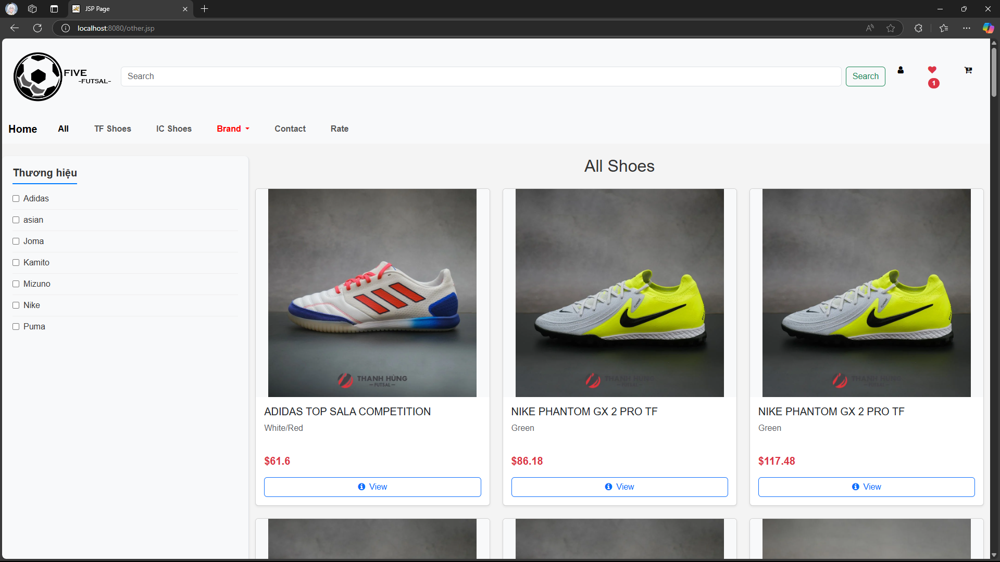
_trang hiểu thị chung các hãng giày, cũng như lọc các hãng giày_

### Chi tiết sản phẩm

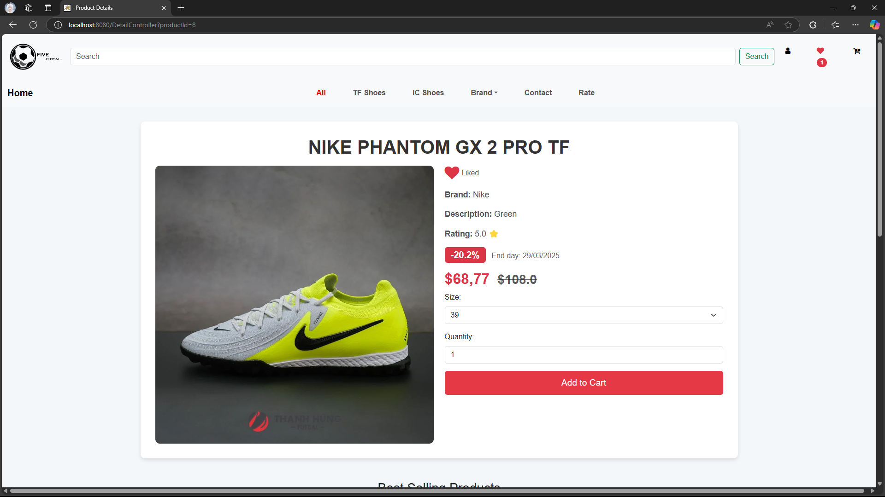
_trang hiểu thị chi tiết thông tin sản phẩm để người dùng mua hàng_

### Trạng thái đơn hàng

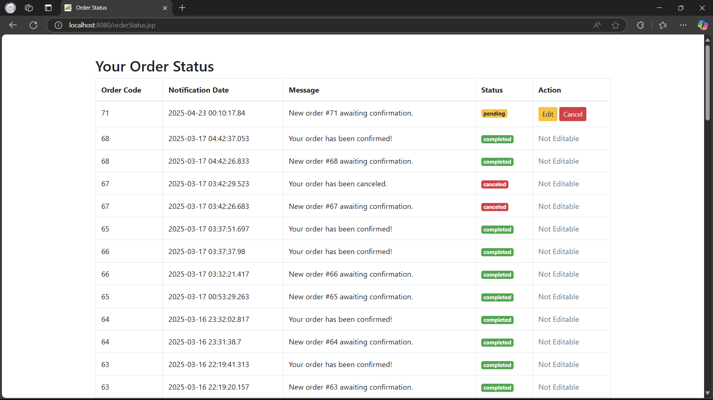
_hiểu thị trang thái đơn hàng sau khi người dùng đặt hàng thành công, trước khi đơn hàng được xác nhận người dùng có thể sửa hoặc xóa đơn hàng_

### Sơ đồ cơ sở dữ liệu của dự án


_sơ đồ cơ sở dữ liệu của dự án_

Và còn một số chức năng khác của trang web, cũng như một số tính năng dẫn đang phát triển

---

---

## 📬 Liên Hệ

[](tam.nguyen.ia.cm@gmail.com)
[](tel:0933561709)

---

> "Không chỉ là giày - Đó là phong cách sống của bạn!" ✨

```

```
